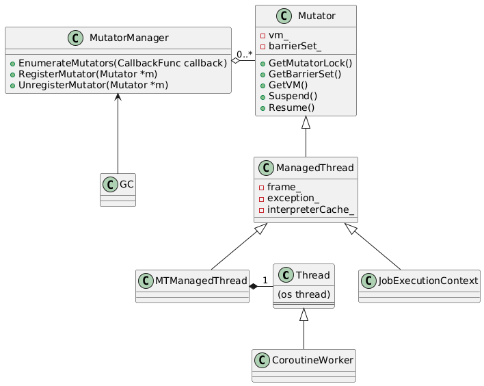

# Mutators

## Key definitions

__Mutator__ is an entity that can _mutate_ the managed heap state (read/write references, allocate objects).  
__ManagedThread__ is a mutator that can execute bytecode and has a state for this purpose.  

Mutator is not an OS thread and is not mapped one-to-one with an OS thread.
A mutator can be executed on several OS threads, and one OS thread can execute several mutators at different times.

## Class structure

The mutator class provides interfaces to correct work with the managed object heap.
GC notifies all mutators about suspending/resuming for the STW phase.   

* `Mutator` is a base class for all entities that can change the managed heap state. Example of mutators:
  * GC tasks
  * `ManagedThread`
  * JIT tasks
* `MTManagedThread` represents a class for one ManagedThread per os thread
